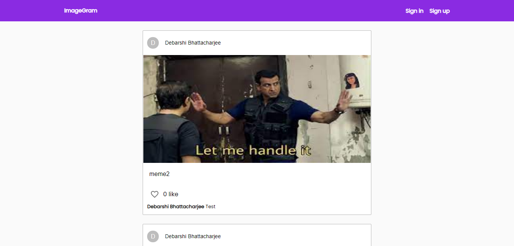
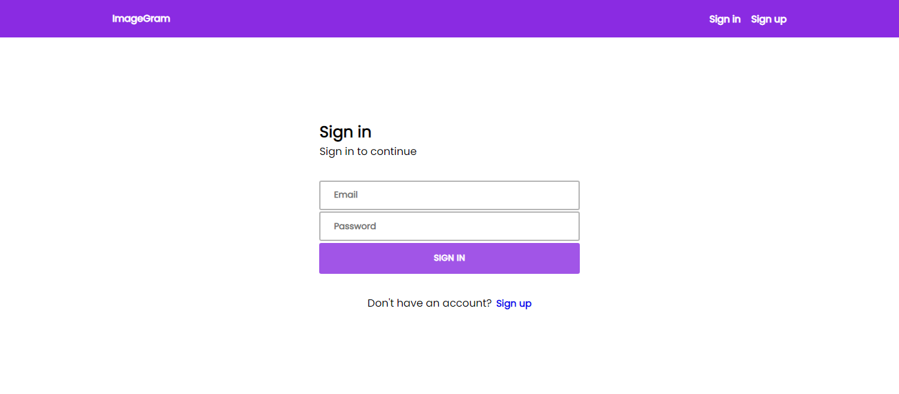
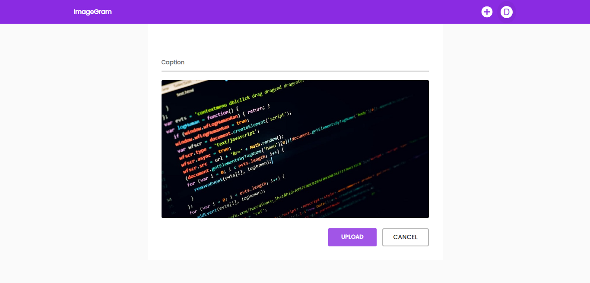
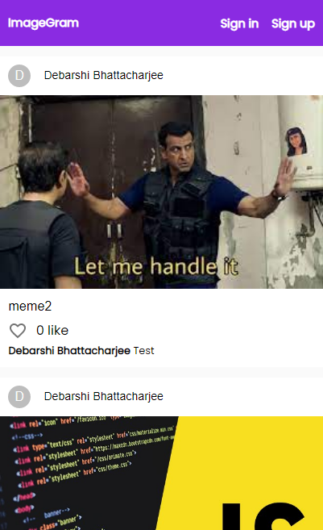
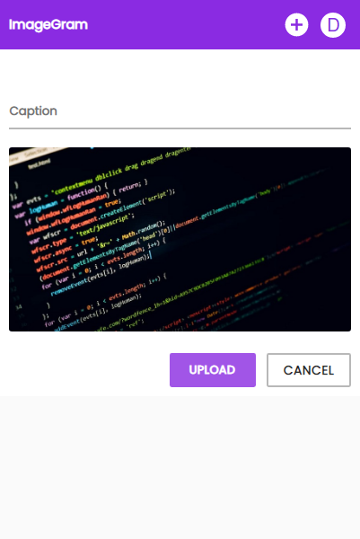
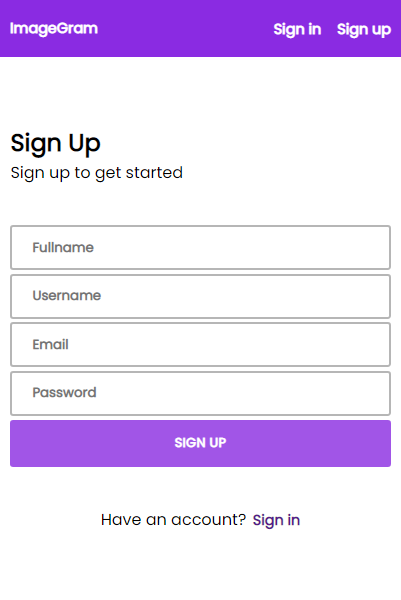

[](https://github.com/Debarshi95/image-gram/actions)

[](https://app.netlify.com/sites/debarshib-imagegram/deploys)

# ImageGram

A responsive image sharing web app.

## Demo

[Deployed on Netlify using github actions](https://debarshib-imagegram.netlify.app/)

## Features:

- Users can see uploaded images
- Authenticated users can comment, like/unlike other's posts
- Authenticated users can upload new posts
- Registration facility for new users
- Registered user can like/unlike, comment on other's photos
- Uses context api to handle user's state and posts data
- Uses custom hook based on Intersection Observer to lazyload posts
- LazyLoading/Code-splitting of components to dynamically load at runtime.
- Loading Spinner when fetching initial data.
- Responsive UI for all screens (Desktop, Tablet, Mobile)

## Built using:

- [ReactJS](https://reactjs.org/) - Frontend framework
- [Material UI](https://mui.com) - UI library
- [Firebase](https://firebase.google.com) - serves as backend to store data and authentication
- [React Toast Notification](https://jossmac.github.io/react-toast-notifications/) - to show toast messages

## Screenshots

#### Desktop








<br/>

#### Mobile

<br/>
<div align="center">







</div>

## Run Locally

- Clone the project
  ```
  git clone https://github.com/Debarshi95/ImageGram.git
  ```
- Go to the project directory
- cd **image-gram**
- Install dependencies
  ```
  yarn
  ```
- Create a **.env.local** file
- Create a project inside Google Firebase and export the configuration
- Add the following configuration to your .env file

  ```
  REACT_APP_API_KEY="<Firebase API_KEY>"
  REACT_APP_AUTH_DOMAIN="<Firebase AUTH_DOMAIN>"
  REACT_APP_PROJECT_ID="<Firebase PROJECT_ID>"
  REACT_APP_STORAGE_BUCKET="<Firebase STORAGE_BUCKET>"
  REACT_APP_MESSAGING_SENDER_ID="<Firebase MESSAGING_SENDER_ID>"
  REACT_APP_APP_ID="<Firebase APP_ID>"
  ```

- Start the server
  ```
  yarn start
  ```

## License

[MIT](LICENSE)
